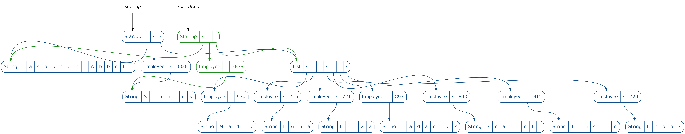
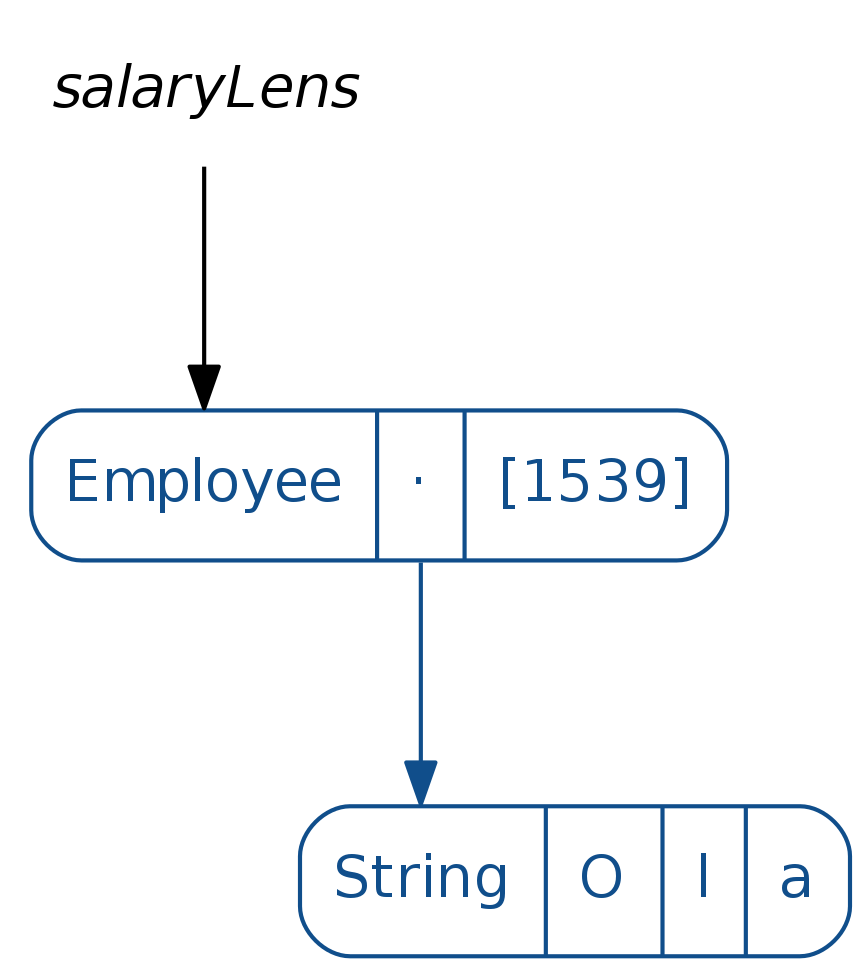
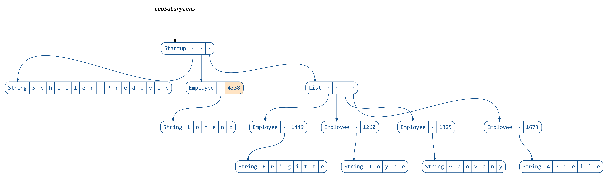
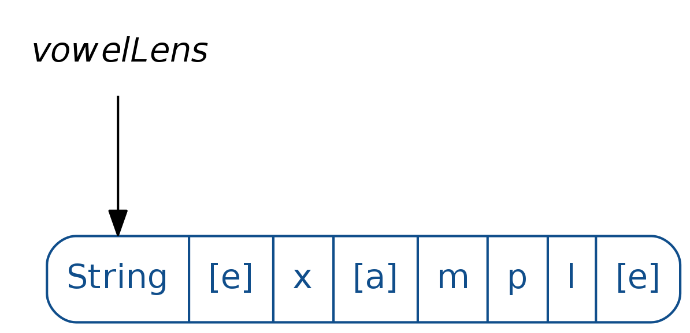
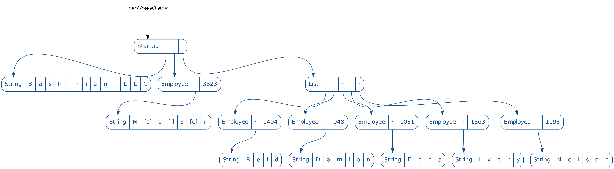

## Lens

### Example

Updating immutable data structures can be tricky.
For case classes Scala gives us the `copy` method:

```scala
case class Employee(
  name: String,
  salary: Long
)
```

```scala
scala> import unzimm.Data._
import unzimm.Data._

scala> import unzimm.Generators._
import unzimm.Generators._

scala> val employee = employees().sample.get
employee: unzimm.Data.Employee = Employee(Reta,1150)

scala> val raisedEmployee = employee.copy(salary = employee.salary + 10)
raisedEmployee: unzimm.Data.Employee = Employee(Reta,1160)
```

However once composition comes into play, the resulting nested immutable data structures
would require a lot of `copy` calls: 

```scala
case class Employee(
  name: String,
  salary: Long
)

case class Startup(
  name: String,
  ceo: Employee,
  team: List[Employee]
)
```

```scala
scala> val startup = startups().sample.get
startup: unzimm.Data.Startup = Startup(Jacobson-Abbott,Employee(Stanley,3828),List(Employee(Madie,930), Employee(Luna,716), Employee(Eliza,721), Employee(Ladarius,893), Employee(Scarlett,840), Employee(Tristin,815), Employee(Brook,720)))

scala> val raisedCeo = startup.copy(
     |   ceo = startup.ceo.copy(
     |     salary = startup.ceo.salary + 10
     |   )
     | )
raisedCeo: unzimm.Data.Startup = Startup(Jacobson-Abbott,Employee(Stanley,3838),List(Employee(Madie,930), Employee(Luna,716), Employee(Eliza,721), Employee(Ladarius,893), Employee(Scarlett,840), Employee(Tristin,815), Employee(Brook,720)))
```


<p align="center"></p>

Ouch!

A common solution to this problem is a “lens”.
In the simplest case a lens is a pair of functions to get and set a value of type `B` inside a value of type `A`.
It’s called a lens because it focuses on some part of the data and allows to update it.
For example, here is a lens that focuses on an employee’s salary
(using the excellent [Monocle library](https://github.com/julien-truffaut/Monocle)):

```scala
scala> import monocle.macros.GenLens
import monocle.macros.GenLens

scala> val salaryLens = GenLens[Employee](_.salary)
warning: there was one feature warning; re-run with -feature for details
salaryLens: monocle.Lens[unzimm.Data.Employee,Long] = $anon$1@7e760a32

scala> salaryLens.get(startup.ceo)
res1: Long = 3828

scala> salaryLens.modify(s => s + 10)(startup.ceo)
res2: unzimm.Data.Employee = Employee(Stanley,3838)
```


<p align="center"></p>

We can also define a lens that focuses on the startup’s CEO:

```scala
scala> val ceoLens = GenLens[Startup](_.ceo)
warning: there was one feature warning; re-run with -feature for details
ceoLens: monocle.Lens[unzimm.Data.Startup,unzimm.Data.Employee] = $anon$1@191b799c

scala> ceoLens.get(startup)
res4: unzimm.Data.Employee = Employee(Stanley,3828)
```


<p align="center"></p>

It’s not apparent yet how this would help, but the trick is that lenses can be composed:

```scala
scala> val ceoSalaryLens = ceoLens composeLens salaryLens
ceoSalaryLens: monocle.PLens[unzimm.Data.Startup,unzimm.Data.Startup,Long,Long] = monocle.PLens$$anon$1@5d6f75ac

scala> ceoSalaryLens.get(startup)
res6: Long = 3828

scala> ceoSalaryLens.modify(s => s + 10)(startup)
res7: unzimm.Data.Startup = Startup(Jacobson-Abbott,Employee(Stanley,3838),List(Employee(Madie,930), Employee(Luna,716), Employee(Eliza,721), Employee(Ladarius,893), Employee(Scarlett,840), Employee(Tristin,815), Employee(Brook,720)))
```


<p align="center"></p>

One interesting thing is that lenses can focus on anything, not just direct attributes of the data.
Here is a lens that focuses on all vowels in a string:

```scala
import unzimm.LensDiagrams.vowelLens
```


<p align="center"></p>

We can use it to give our CEO a funny name:

```scala
scala> val employeeNameLens = GenLens[Employee](_.name)
warning: there was one feature warning; re-run with -feature for details
employeeNameLens: monocle.Lens[unzimm.Data.Employee,String] = $anon$1@65c6cda6

scala> val ceoVowelLens = ceoLens composeLens employeeNameLens composeLens vowelLens
ceoVowelLens: monocle.PLens[unzimm.Data.Startup,unzimm.Data.Startup,Char,Char] = monocle.PLens$$anon$1@2412c473

scala> ceoVowelLens.modify(v => v.toUpper)(startup)
res10: unzimm.Data.Startup = Startup(Jacobson-Abbott,Employee(StAnlEy,3828),List(Employee(Madie,930), Employee(Luna,716), Employee(Eliza,721), Employee(Ladarius,893), Employee(Scarlett,840), Employee(Tristin,815), Employee(Brook,720)))
```


<p align="center"></p>

So far we have replaced the `copy` boilerplate with a number of lens declarations.
However most of the time our goal is just to update data.

In Scala there is a great library called [quicklens](https://github.com/adamw/quicklens)
that allows to do exactly that, creating all the necessary lenses under the hood:

```scala
scala> import com.softwaremill.quicklens._
import com.softwaremill.quicklens._

scala> val raisedCeo = startup.modify(_.ceo.salary).using(s => s + 10)
raisedCeo: unzimm.Data.Startup = Startup(Jacobson-Abbott,Employee(Stanley,3838),List(Employee(Madie,930), Employee(Luna,716), Employee(Eliza,721), Employee(Ladarius,893), Employee(Scarlett,840), Employee(Tristin,815), Employee(Brook,720)))
```

You might think this is approaching the syntax for updating mutable data,
but actually we have already surpassed it, since lens are much more flexible:


```scala
scala> import com.softwaremill.quicklens._
import com.softwaremill.quicklens._

scala> val raisedEveryone = startup.modifyAll(_.ceo.salary, _.team.each.salary).using(s => s + 10)
raisedEveryone: unzimm.Data.Startup = Startup(Jacobson-Abbott,Employee(Stanley,3838),List(Employee(Madie,940), Employee(Luna,726), Employee(Eliza,731), Employee(Ladarius,903), Employee(Scarlett,850), Employee(Tristin,825), Employee(Brook,730)))
```
